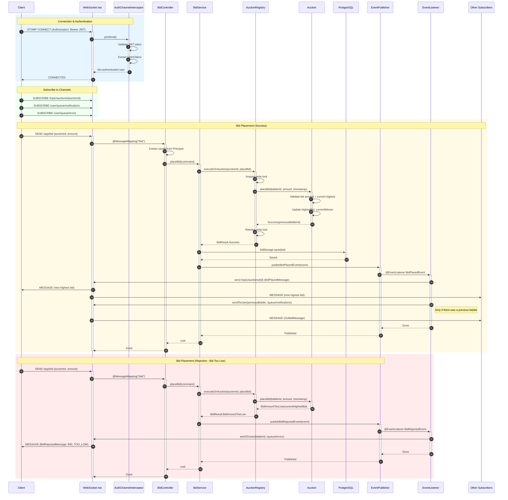

# Auction Platform Demo Project

This project is a sample application to demonstrate some Spring Boot basics,
as well as explore hexagonal architecture.
It is not intended for production use, but more as a learning resource for myself.
The project will grow over time to incorporate more features / patterns,
as I get free time to work on it. Currently, it is far from finished.

## The Project

The idea behind this project is to build some sort of auction platform for real time bidding.
Users can create accounts, manage auctions and bid on active auctions. There is also a secondary
microservice, the Pricing Service, which can set a starting price if a user has not provided
one themselves.

*The pricing service has not yet been implemented and was just meant to be used to demonstrate gRPC
communication between two services.*

Some decisions may seem weird at first glance. For example the use of UUIDs, which is mostly useful
when working in a distributed system. However, other parts of the system like the in-memory auction
registry supporting bidding, will not work in such a distributed system at all. So we could've just
as easily went with another data type for IDs, like a Long.

## Technology Stack

| Category | Technology |
|----------|------------|
| Language | Java 21 |
| Framework | Spring Boot 3.5.6 |
| Build Tool | Gradle (Kotlin DSL) |
| Database | PostgreSQL |
| Migrations | Flyway |
| Authentication | JWT (JJWT 0.13.0) + Spring Security |
| Real-time | WebSocket with STOMP |
| Inter-service | gRPC (configured for price-service) |
| Testing | JUnit 5, AssertJ, Testcontainers |

## Project Structure

The project is a multi-module Gradle Kotlin monorepo:

```
auction-platform/
├── build.gradle.kts              # Root configuration (Java 21, JUnit 5)
├── settings.gradle.kts           # Defines subprojects
├── auction-service/              # Main service (Java/Spring Boot)
│   ├── src/main/java/wpessers/auctionservice/
│   │   ├── auction/              # Auction domain and operations
│   │   ├── bid/                  # Bidding system and events
│   │   ├── user/                 # User authentication and management
│   │   └── shared/               # Cross-cutting concerns
│   ├── src/main/resources/
│   │   ├── db/migration/         # Flyway SQL migrations
│   │   └── proto/                # gRPC protocol buffer definitions
│   └── src/test/java/            # Unit and integration tests
└── price-service/                # Secondary service (Kotlin/Spring Boot)
```

## Architecture

This project implements **Hexagonal Architecture** (Ports & Adapters pattern) with clear separation between domain, application, and infrastructure layers.

### Layer Overview

```
┌─────────────────────────────────────────────────────────────────────┐
│                        INFRASTRUCTURE LAYER                          │
│  ┌─────────────────────────────┐  ┌─────────────────────────────┐   │
│  │     Inbound Adapters        │  │     Outbound Adapters       │   │
│  │  • REST Controllers         │  │  • JPA Repositories         │   │
│  │  • WebSocket Handlers       │  │  • In-Memory Registry       │   │
│  │  • JWT Filters              │  │  • UUID Generator           │   │
│  │  • Event Listeners          │  │  • JWT Token Provider       │   │
│  └──────────────┬──────────────┘  └──────────────▲──────────────┘   │
│                 │                                │                   │
│ ┌───────────────▼────────────────────────────────┴────────────────┐ │
│ │                      APPLICATION LAYER                          │ │
│ │  ┌─────────────────────┐  ┌──────────────────────────────────┐  │ │
│ │  │    Use Cases        │  │         Ports                    │  │ │
│ │  │  • AuctionService   │  │  In:  Commands, Responses        │  │ │
│ │  │  • BidService       │  │  Out: AuctionStorage,            │  │ │
│ │  │  • UserAuthService  │  │       AuctionRegistry,           │  │ │
│ │  │                     │  │       BidEventPublisher, etc.    │  │ │
│ │  └─────────────────────┘  └──────────────────────────────────┘  │ │
│ └──────────────────────────────┬──────────────────────────────────┘ │
│                                │                                     │
│ ┌──────────────────────────────▼──────────────────────────────────┐ │
│ │                        DOMAIN LAYER                              │ │
│ │  • Entities: Auction, User                                       │ │
│ │  • Value Objects: Money, AuctionWindow                           │ │
│ │  • Records: Bid                                                  │ │
│ │  • Domain Events: BidPlacedEvent, BidRejectedEvent               │ │
│ │  • Domain Exceptions: AuctionNotFoundException, etc.             │ │
│ │  • Result Types: BidResult (Success | BidAmountTooLow | ...)     │ │
│ └──────────────────────────────────────────────────────────────────┘ │
└─────────────────────────────────────────────────────────────────────┘
```

### Package Structure per Domain

Each domain module follows a consistent structure:

```
auction/
├── domain/
│   ├── Auction.java              # Aggregate root entity
│   ├── AuctionWindow.java        # Value object
│   ├── AuctionStatus.java        # Enum
│   └── exceptions/               # Domain-specific exceptions
├── application/
│   ├── AuctionService.java       # Use case orchestration
│   ├── port/
│   │   ├── in/                   # Input ports (commands/responses)
│   │   │   ├── CreateAuctionCommand.java
│   │   │   └── AuctionResponse.java
│   │   └── out/                  # Output ports (interfaces)
│   │       ├── AuctionStorage.java
│   │       └── AuctionRegistry.java
└── infrastructure/
    ├── in/                       # Inbound adapters
    │   └── web/
    │       └── AuctionController.java
    └── out/                      # Outbound adapters
        ├── persistence/jpa/
        │   ├── JpaAuctionStorageAdapter.java
        │   └── AuctionEntityMapper.java
        └── cache/inmemory/
            └── InMemoryAuctionRegistryAdapter.java
```

### Dependency Direction

- **Domain** → No external dependencies, pure business logic
- **Application** → Depends only on Domain + Output Port interfaces
- **Infrastructure** → Implements interfaces from Application layer

## Design Patterns

### Ports & Adapters (Hexagonal)

**Output Ports** (interfaces the application needs):
- `AuctionStorage` - Persistence abstraction
- `AuctionRegistry` - In-memory auction registry for active bidding
- `BidStorage` - Bid persistence
- `BidEventPublisher` - Event publishing abstraction
- `UserStorage` - User persistence
- `IdGenerator` - ID generation abstraction
- `TimeProvider` - Time abstraction for testing
- `TokenGenerator` / `TokenParser` - JWT abstraction

**Adapter Implementations**:
- `JpaAuctionStorageAdapter` implements `AuctionStorage`
- `InMemoryAuctionRegistryAdapter` implements `AuctionRegistry`
- `SpringBidEventPublisherAdapter` implements `BidEventPublisher`
- `UUIDv4IdGeneratorAdapter` implements `IdGenerator`

### Result Type Pattern

Instead of throwing exceptions for expected failures, the bid placement returns a sealed `BidResult` type:

```java
public sealed interface BidResult {
    record Success(UUID previousBidderId) implements BidResult {}
    record BidAmountTooLow(Money currentHighestBid) implements BidResult {}
    record AuctionNotActive() implements BidResult {}
}
```

This enables type-safe error handling and allows results to carry additional context data.

### Event-Driven Architecture

The bidding flow uses domain events for real-time updates via WebSocket/STOMP:



**Key Components:**

| Component | Responsibility |
|-----------|----------------|
| `AuthChannelInterceptor` | Validates JWT on STOMP CONNECT, sets authenticated user |
| `BidController` | WebSocket message handler (`@MessageMapping("/bid")`) |
| `BidService` | Orchestrates bid placement, publishes domain events |
| `AuctionRegistry` | Thread-safe in-memory auction state with write locks |
| `Auction` | Domain logic: validates bid, returns `BidResult` sealed type |
| `SpringBidEventPublisher` | Publishes Spring application events |
| `SpringBidEventListener` | Routes events to WebSocket destinations |

**WebSocket Destinations:**

| Destination | Type | Purpose |
|-------------|------|---------|
| `/topic/auctions/{id}` | Broadcast | All subscribers receive bid updates |
| `/user/queue/notifications` | User-specific | Outbid notifications to previous bidder |
| `/user/queue/errors` | User-specific | Bid rejection errors to bidder |

### Entity Mapper Pattern

Mappers handle the impedance mismatch between domain objects and persistence entities:

```java
// AuctionEntityMapper converts:
// Domain: Auction (with Money, AuctionWindow value objects)
// ↔ Persistence: AuctionEntity (with BigDecimal, separate Instant fields)
```

### Builder Pattern

Test fixtures use fluent builders for creating domain objects:

```java
Auction auction = new AuctionBuilder()
    .withName("Test Auction")
    .withStatus(AuctionStatus.ACTIVE)
    .withStartingPrice(Money.of(100))
    .build();
```

### Thread Safety in Registry

The `InMemoryAuctionRegistryAdapter` uses:
- `ConcurrentHashMap<UUID, AuctionHolder>` for auction storage
- `ReentrantReadWriteLock` per auction for thread-safe bid operations

```java
public <T> T executeOnAuction(UUID auctionId, Function<Auction, T> action) {
    AuctionHolder holder = auctions.get(auctionId);
    holder.lock.writeLock().lock();
    try {
        return action.apply(holder.auction);
    } finally {
        holder.lock.writeLock().unlock();
    }
}
```

## Naming Conventions

### Package Naming

```
wpessers.auctionservice.[domain].[layer].[sublayer]

Examples:
├── wpessers.auctionservice.auction.domain
├── wpessers.auctionservice.auction.application.port.out
├── wpessers.auctionservice.auction.infrastructure.in.web
└── wpessers.auctionservice.auction.infrastructure.out.persistence.jpa
```

### Class Naming

| Type | Pattern | Examples |
|------|---------|----------|
| Domain Entities | Simple noun | `Auction`, `User` |
| Value Objects | Simple noun | `Money`, `AuctionWindow` |
| Ports (interfaces) | Noun-based | `AuctionStorage`, `IdGenerator`, `BidEventPublisher` |
| Adapters | `[Technology][Port]Adapter` | `JpaAuctionStorageAdapter`, `InMemoryAuctionRegistryAdapter` |
| Commands | `[Action][Entity]Command` | `CreateAuctionCommand`, `PlaceBidCommand` |
| Responses | `[Entity]Response` | `AuctionResponse` |
| Domain Events | `[Action]Event` | `BidPlacedEvent`, `BidRejectedEvent` |
| Controllers | `[Domain]Controller` | `AuctionController`, `BidController` |
| Services | `[Domain]Service` | `AuctionService`, `BidService` |
| Entity Mappers | `[Entity]EntityMapper` | `AuctionEntityMapper` |
| JPA Entities | `[Domain]Entity` | `AuctionEntity`, `BidEntity` |
| Repositories | `[Domain]Repository` | `AuctionRepository` |
| Exceptions | `[Reason]Exception` | `AuctionNotFoundException`, `InvalidStartingPriceException` |

### Java Records Usage

Java records are used extensively for immutable data structures:
- Commands: `CreateAuctionCommand`, `PlaceBidCommand`
- Responses: `AuctionResponse`
- Domain Events: `BidPlacedEvent`, `BidRejectedEvent`
- Value Objects: `Bid`, `User`, `UserClaims`
- WebSocket Messages: `PlaceBidMessage`, `BidRejectedMessage`

## Key Domain Components

### Auction (Aggregate Root)

The central domain entity with:
- Immutable identity: `id`, `name`, `description`, `window`, `startingPrice`
- Mutable state: `status`, `highestBid`, `currentWinner`, `bidVersion`
- Behavior: `start()`, `end()`, `placeBid()`
- Invariants: Negative starting prices rejected, state transitions enforced

### AuctionWindow (Value Object)

Encapsulates auction timing with validation:
- `startTime` and `endTime` (Instant)
- Validates: `endTime` must be after `startTime`
- Provides: `isWithinWindow(timestamp)` for bid timing checks

### Money (Value Object)

Represents monetary values with precision:
- Wraps `BigDecimal` with 2-decimal scale
- Provides: `isNegative()`, `isLessThanOrEqualTo()`, `isGreaterThanOrEqualTo()`
- Automatic scale normalization on construction

### BidResult (Sealed Type)

Type-safe result for bid placement:
- `Success` - Includes previous bidder ID for notification
- `BidAmountTooLow` - Includes current highest bid
- `AuctionNotActive` - Auction is not accepting bids

## API Endpoints

### REST API

| Method | Endpoint | Auth | Description |
|--------|----------|------|-------------|
| POST | `/api/auth/register` | No | Register new user |
| POST | `/api/auth/login` | No | Login and receive JWT |
| POST | `/api/auctions` | Yes | Create new auction |
| GET | `/api/auctions/{id}` | No | Get auction by ID |
| GET | `/api/auctions/active` | No | Get all active auctions |

### WebSocket (STOMP)

| Destination | Direction | Description |
|-------------|-----------|-------------|
| `/app/bid` | Client → Server | Place a bid |
| `/topic/auctions/{id}` | Server → Client | Bid updates for auction |
| `/queue/notifications` | Server → Client | Personal notifications (outbid) |
| `/queue/errors` | Server → Client | Bid rejection errors |

Connection endpoint: `/ws`

## Configuration

### Environment Variables

```bash
JWT_SECRET=<base64-encoded-secret>  # JWT signing key
POSTGRES_DB=auction                  # Database name
POSTGRES_USER=postgres               # Database user
POSTGRES_PW=password                 # Database password
```

### Spring Profiles

- `dev` - Development (localhost database, in-memory registry)
- `test` - Testing (Testcontainers PostgreSQL)
- Default - Production configuration

### Security Configuration

- Stateless session management (JWT-based)
- Public endpoints: `/api/auth/**`, GET `/api/auctions/**`, `/ws/**`
- Protected endpoints: POST `/api/auctions`, bid operations
- JWT filter validates tokens on protected routes
- WebSocket auth interceptor validates on STOMP CONNECT

## Testing

### Test Organization

```
src/test/java/wpessers/auctionservice/
├── auction/
│   ├── domain/AuctionTests.java           # Domain logic tests
│   ├── application/AuctionServiceTests.java
│   └── infrastructure/
│       ├── in/web/AuctionControllerTest.java
│       └── out/.../AuctionEntityMapperTest.java
├── bid/
│   ├── application/BidServiceTests.java
│   └── infrastructure/...
├── user/
│   └── application/UserAuthServiceTest.java
├── shared/
│   └── infrastructure/out/
│       ├── generation/StubIdGeneratorAdapter.java
│       └── time/StubTimeProviderAdapter.java
├── fixtures/
│   ├── AuctionBuilder.java
│   └── CreateAuctionCommandBuilder.java
└── integration/AuctionServiceApplicationTests.java
```

### Testing Patterns

**Fake/Stub Adapters**: Replace production adapters in tests
- `FakeAuctionStorageAdapter` - In-memory storage
- `StubIdGeneratorAdapter` - Deterministic UUIDs
- `StubTimeProviderAdapter` - Controllable time

**Parameterized Tests**: Test multiple scenarios
```java
@ParameterizedTest
@EnumSource(value = AuctionStatus.class, names = {"SCHEDULED", "CLOSED"})
void shouldRejectBidWhenAuctionNotActive(AuctionStatus status) { ... }
```

**Integration Tests**: Use Testcontainers for PostgreSQL
```java
@SpringBootTest
@Testcontainers
class AuctionServiceApplicationTests {
    @Container
    static PostgreSQLContainer<?> postgres = new PostgreSQLContainer<>("postgres:15");
}
```

## Database Schema

```sql
-- Auctions table
auctions (
    id UUID PRIMARY KEY,
    name VARCHAR NOT NULL,
    description TEXT,
    start_time TIMESTAMP NOT NULL,
    end_time TIMESTAMP NOT NULL,
    starting_price DECIMAL(19,2) NOT NULL,
    status VARCHAR NOT NULL
)

-- Users table (unique username and email)
users (
    id UUID PRIMARY KEY,
    username VARCHAR UNIQUE NOT NULL,
    password VARCHAR NOT NULL,
    email VARCHAR UNIQUE NOT NULL
)

-- Bids table (indexed on auction_id)
bids (
    id UUID PRIMARY KEY,
    auction_id UUID REFERENCES auctions(id),
    bidder_id UUID REFERENCES users(id),
    amount DECIMAL(19,2) NOT NULL,
    timestamp TIMESTAMP NOT NULL
)
```

Migrations are managed by Flyway in `src/main/resources/db/migration/`.

## Running the Application

### Prerequisites

- Java 21
- PostgreSQL (or use Docker)
- Gradle

### Development

```bash
# Start PostgreSQL (if using Docker)
docker run -d --name postgres \
  -e POSTGRES_DB=auction \
  -e POSTGRES_USER=postgres \
  -e POSTGRES_PASSWORD=password \
  -p 5432:5432 postgres:15

# Set environment variables
export JWT_SECRET=$(openssl rand -base64 32)
export POSTGRES_DB=auction
export POSTGRES_USER=postgres
export POSTGRES_PW=password

# Run the application
./gradlew :auction-service:bootRun --args='--spring.profiles.active=dev'
```

### Running Tests

```bash
# Run all tests
./gradlew test

# Run specific test class
./gradlew test --tests "AuctionTests"
```
